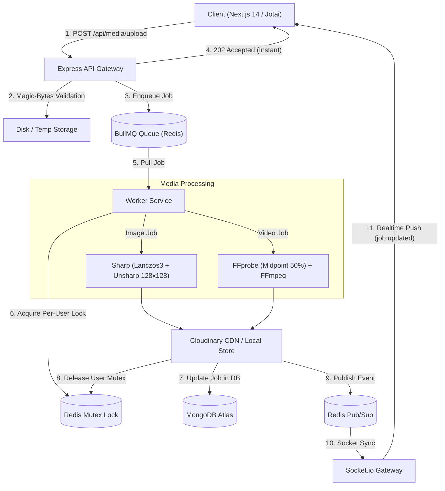

# 🎬 Async Thumbnail Generation System for Images & Videos

A high-performance, production-grade **Distributed Asynchronous Media Processing Pipeline** built with **Express.js**, **Next.js 14 (App Router)**, **BullMQ**, **Redis**, **Prisma + MongoDB**, **Sharp**, and **FFmpeg**.

Features **Per-User FIFO Concurrency**, **Real-Time WebSocket Progress Streaming**, **Magic-Bytes File Sniffing**, **Cloudinary CDN Distribution**, **Server & Client Pagination**, and **Google OAuth2 Authentication**.

---

## 🌐 Repository & Demo Links

- **GitHub Repository**: [https://github.com/Naitik4897/thumbnail-generation-system](https://github.com/Naitik4897/thumbnail-generation-system)
- **Live Frontend Dashboard**: *Deployable on Vercel (See Deployment Guide below)*
- **API & Realtime Gateway**: *Deployable on Render / Railway*

---

## 📊 1. System Architecture & Features

### 🛠️ Tech Stack Matrix

| Requirement | Technology | Implementation & Role |
| :--- | :--- | :--- |
| **Backend API** | Node.js / Express.js | Modular REST API with Helmet security, rate limiting, and CORS |
| **Frontend UI** | Next.js 14 (App Router) | Responsive dashboard with Glassmorphism aesthetic and modals |
| **Database & ORM** | MongoDB Atlas + Prisma | Indexed `User` and `MediaJob` models with multi-host replica support |
| **Queue & Broker** | BullMQ + Redis | Distributed queue with producer/consumer architecture & failure retry |
| **Language & Types** | TypeScript (Strict) | Monorepo-wide strict TypeScript presets (`@repo/types`, `@repo/tsconfig`) |
| **State Management** | Jotai | Atomic reactive state (`authAtom`, `jobsAtom`, `mediaStatsAtom`, `paginationAtom`) |
| **Media Processing** | Sharp & Fluent-FFmpeg | Lanczos3 high-clarity 128×128 image crop + 50% midpoint video extractor |
| **Containerization** | Docker & Kubernetes | Multi-stage Dockerfiles, `docker-compose.yml`, and K8s manifests with HPA |

---

### 👤 User Stories & Feature Checklist

| User Story / Requirement | Description |
| :--- | :--- |
| **Sign Up / Log In** | Email/Password with bcrypt + Google OAuth2 with DB session persistence |
| **Multi-File Upload** | Upload multiple images & videos simultaneously with magic-bytes binary validation |
| **Immediate Feedback** | Upload endpoint immediately returns `202 Accepted` with queued job IDs |
| **Per-User FIFO Lock** | Distributed Redis mutex locks ensure a user's jobs run sequentially one at a time |
| **Live Status Transitions** | Real-time WebSocket streaming: `QUEUED` 🟡 ➔ `PROCESSING` 🔵 ➔ `COMPLETED` 🟢 ➔ `FAILED` 🔴 |
| **Video Midpoint Frame** | FFprobe probes total video duration and extracts frame at exact 50% timestamp |
| **High Clarity 128×128** | Sharp Lanczos3 kernel, unsharp mask, and 4:4:4 chroma subsampling for crisp detail |
| **Cloudinary CDN** | Uploads thumbnails to Cloudinary CDN with fallback to local storage |
| **Pagination & Global Stats** | Strict 8/16/24 items per page + hero metrics showing overall total library counts |
| **Download & Preview** | Direct 128×128 native modal preview and secure tokenized file downloads |

---

## 🏛️ 2. High-Level Architecture Flow



---

## 🚀 3. Step-by-Step Developer Setup Guide

### Prerequisites
- **Node.js**: `v18.0.0` or later
- **npm**: `v9.0.0` or later
- **Redis Server**: Running locally or via Docker
- **FFmpeg**: Installed locally (or run via Docker)

---

### Method A: Local Monorepo Setup (Turborepo)

#### 1. Clone the Repository
```bash
git clone https://github.com/Naitik4897/thumbnail-generation-system.git
cd thumbnail-generation-system
```

#### 2. Install Dependencies
```bash
npm install
```

#### 3. Setup Environment Variables
Create `.env` in the root and in the service folders from `.env.example`:
```bash
cp .env.example .env
```

#### 4. Generate Prisma Clients
```bash
npm run db:generate
```

#### 5. Start Development Servers
```bash
npm run dev
```
- **Frontend Dashboard**: `http://localhost:3000`
- **Backend API & WebSockets**: `http://localhost:5000`

---

### Method B: 1-Click Docker Compose Setup

Run the full 5-container topology (`MongoDB`, `Redis`, `API`, `Worker`, `Frontend`) with a single command:
```bash
docker-compose up --build
```
Everything will spin up automatically with pre-configured health checks and persistent volumes.

---

## 🔑 4. Credentials & Configuration Reference

### 👤 Demo / Test User Credentials
For testing and review, you can use the pre-configured test account:
- **Email**: `nrmaisuriya3@gmail.com`
- **Password**: `Naitik@1234`

### Cloudinary CDN Configuration
```env
STORAGE_STRATEGY=cloudinary
CLOUDINARY_CLOUD_NAME=your_cloudinary_cloud_name
CLOUDINARY_API_KEY=your_cloudinary_api_key
CLOUDINARY_API_SECRET=your_cloudinary_api_secret
```

### Google OAuth2 Configuration
```env
NEXT_PUBLIC_GOOGLE_CLIENT_ID=your_google_client_id.apps.googleusercontent.com
GOOGLE_CLIENT_ID=your_google_client_id.apps.googleusercontent.com
GOOGLE_CLIENT_SECRET=your_google_client_secret
```
> **Google Cloud Console Settings**:
> Add `http://localhost:3000` and your production domain under **Authorized JavaScript origins** in Google Cloud Console.

### MongoDB Connection
```env
DATABASE_URL=mongodb+srv://<username>:<password>@cluster.mongodb.net/thumbnail_db?retryWrites=true&w=majority
```

---

## 🧪 5. Sample Assets for Testing

- **📁 Google Drive Test Media Folder (Images & Videos)**: [Download Test Media Pack](https://drive.google.com/drive/folders/1slUOQFzf6hjqbeFBivdyUBhtPLVQ3aQp?usp=sharing)

You can also use these direct public sample files to test multi-file batch uploads, high-clarity image resizing, and video midpoint frame extraction:

### Sample Images:
- **PNG (High Resolution Graphic)**: `https://raw.githubusercontent.com/mdn/learning-area/main/html/multimedia-and-embedding/images-in-html/dinosaur_600.png`
- **JPG (Landscape Photo)**: `https://images.unsplash.com/photo-1506744038136-46273834b3fb?w=1200`
- **WEBP (Modern Graphic)**: `https://www.gstatic.com/webp/gallery/1.webp`

### Sample Videos:
- **MP4 Sample 1 (Big Buck Bunny - 5s clip)**: `https://commondatastorage.googleapis.com/gtv-videos-bucket/sample/ForBiggerBlazes.mp4`
- **MP4 Sample 2 (Elephants Dream - 10s clip)**: `https://commondatastorage.googleapis.com/gtv-videos-bucket/sample/ElephantsDream.mp4`

---

## 🐙 6. Step-by-Step Guide to Push to GitHub

Follow these steps to initialize and push this project to your GitHub account:

```bash
# 1. Initialize git repository (if not already initialized)
git init

# 2. Stage all source code files
git add .

# 3. Commit changes
git commit -m "feat: complete production async thumbnail generation system"

# 4. Set default branch to main
git branch -M main

# 5. Add your GitHub remote repository URL
git remote add origin https://github.com/Naitik4897/thumbnail-generation-system.git

# 6. Push code to GitHub
git push -u origin main
```

---

## ☁️ 7. 100% Free Cloud Deployment Guide

You can host this entire distributed system for **free** using the following stack:

### Architecture Topology:
1. **Frontend**: **Vercel** (Free Tier - Unlimited Static & SSR)
2. **Backend API**: **Render** or **Railway** or **Koyeb** (Free Web Service Tier)
3. **Background Worker**: **Render** (Background Worker) or **Koyeb** (Free Micro Instance)
4. **Redis Queue**: **Upstash Redis** (Free Serverless Tier - 10,000 commands/day)
5. **Database**: **MongoDB Atlas** (Free Shared M0 Cluster - 512MB)
6. **Media Storage**: **Cloudinary** (Free Tier - 25GB managed storage & CDN bandwidth)

---

### Deployment Steps:

#### Step 1: Redis Setup on Upstash
1. Go to [Upstash.com](https://upstash.com/) and create a free Redis database.
2. Copy the `REDIS_HOST`, `REDIS_PORT`, and `REDIS_PASSWORD` from the Upstash console.

#### Step 2: Database Setup on MongoDB Atlas
1. Create a free M0 cluster on [MongoDB Atlas](https://www.mongodb.com/cloud/atlas).
2. Copy your connection string into `DATABASE_URL`.

#### Step 3: Deploy Backend API & Worker on Render / Koyeb
1. Connect your GitHub repository to [Render.com](https://render.com/).
2. Create a **Web Service** for `services/api`:
   - Build Command: `npm install && npm run db:generate`
   - Start Command: `npm run start --workspace=@services/api`
   - Add Environment Variables: `DATABASE_URL`, `REDIS_HOST`, `REDIS_PORT`, `REDIS_PASSWORD`, `JWT_SECRET`, `CLOUDINARY_*`.
3. Create a **Background Worker** for `services/worker`:
   - Build Command: `npm install && npm run db:generate`
   - Start Command: `npm run start --workspace=@services/worker`
   - Add Environment Variables matching the API.

#### Step 4: Deploy Frontend on Vercel
1. Go to [Vercel.com](https://vercel.com/) and click **Add New Project**.
2. Select your repository and set Root Directory to `services/frontend`.
3. Add Environment Variables:
   - `NEXT_PUBLIC_API_URL`: `https://your-api-service.onrender.com`
   - `NEXT_PUBLIC_WS_URL`: `https://your-api-service.onrender.com`
   - `NEXT_PUBLIC_GOOGLE_CLIENT_ID`: `your_google_client_id.apps.googleusercontent.com`
4. Click **Deploy**.

---

## 📜 License
MIT License © 2026 Naitik Maisuriya. All rights reserved.
